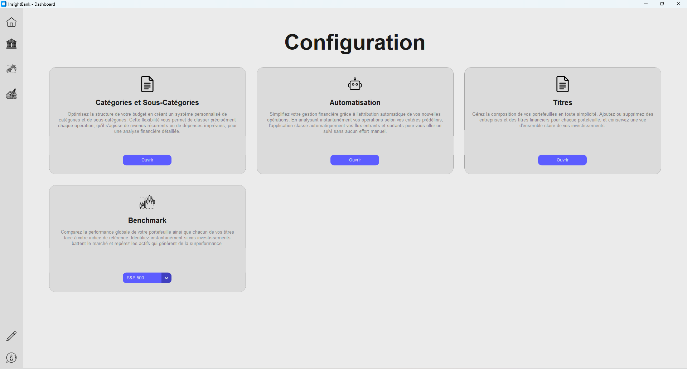
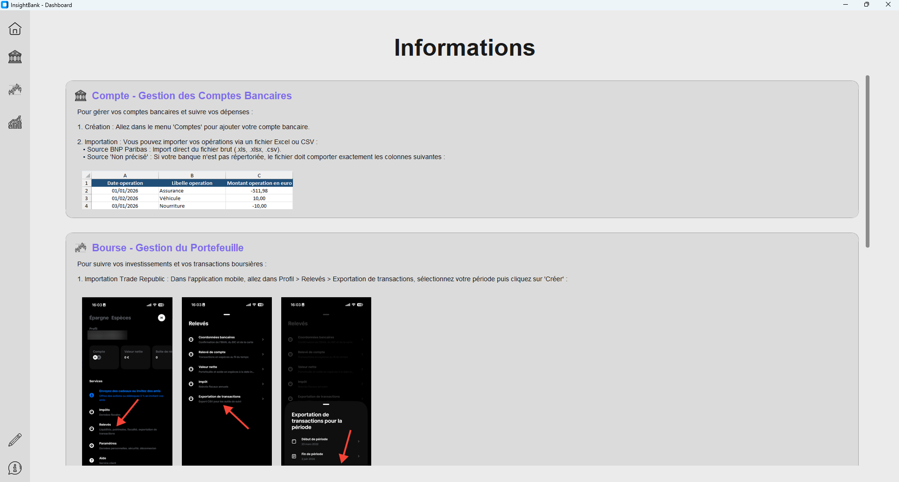
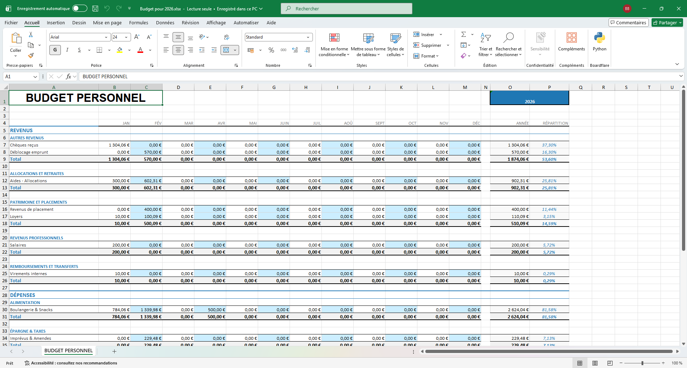
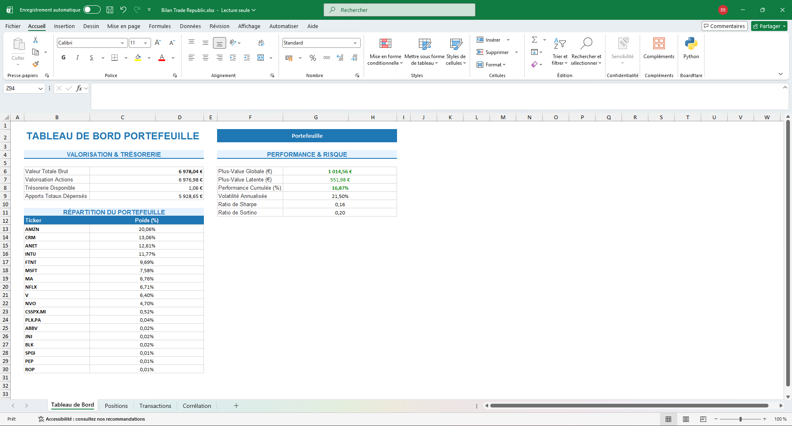
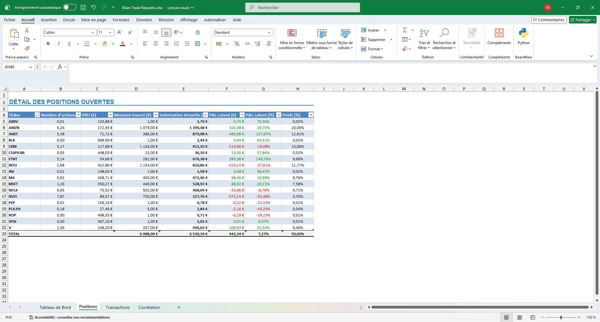
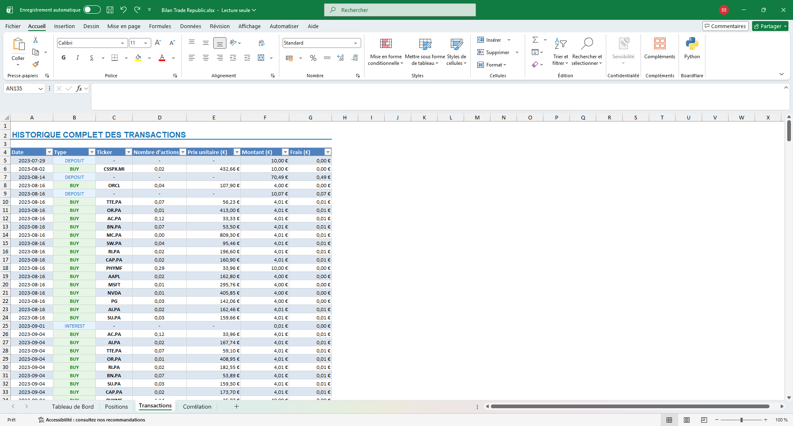
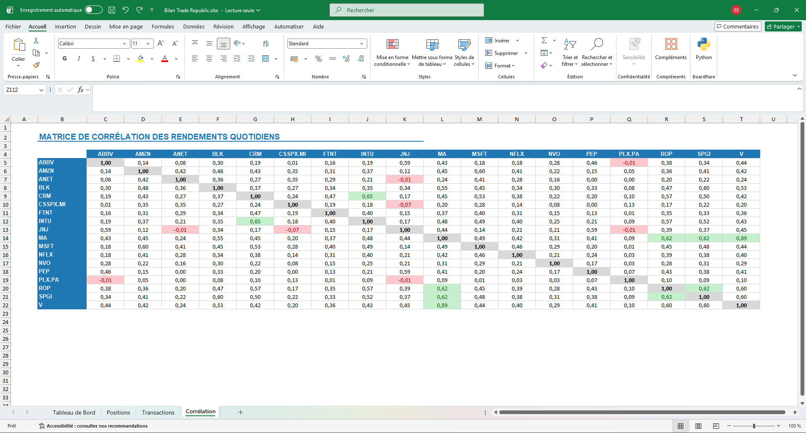

# InsightBank - Dashboard 📊

**InsightBank** est un outil complet de gestion financière et boursière permettant de transformer vos données brutes en tableaux de bord interactifs. Le projet permet de centraliser vos flux bancaires et vos investissements, de catégoriser vos opérations et d'obtenir une vision claire de votre santé financière ainsi que de la performance de vos portefeuilles.

---


| Configuration | Informations |
| :---: | :---: |
|  |  |

---

## 🏦 Module Banque

Le module Banque permet de centraliser vos comptes courants, de catégoriser vos opérations et d'analyser vos flux financiers.

* **Importation des données** : Importez facilement vos relevés. Pour une prise en charge automatique, l'établissement **BNP Paribas** est nativement intégré. Il est également possible d'importer vos propres données bancaires venant d'autres établissements via un format générique.
* **Rapports HTML interactifs** : Génération d'un tableau de bord dynamique complet (graphiques de répartition, flux Sankey, suivi mensuel) téléchargeable pour une consultation hors-ligne.
* **Bilans Excel complets** : Exportation d'un rapport complet récapitulant l'ensemble de vos revenus et dépenses par catégories et sous-catégories.

### Rendu interactif HTML
<video src="https://github.com/user-attachments/assets/19538a56-4bf0-4613-bd4d-fe100d1df5fa" width="100%" controls></video>

### Rapport Excel


---

## 📈 Module Bourse

Le module Bourse permet de suivre la performance globale de vos placements, d'analyser la répartition de vos actifs et de comparer vos rendements à un indice de référence (Benchmark).

* **Importation des données** : Le courtier **Trade Republic** est pris en charge automatiquement à partir de vos exports de transactions. Vous pouvez aussi importer les données d'autres courtiers via un fichier personnalisé.
* **Rapports HTML interactifs** : Analyse visuelle et dynamique de votre portefeuille, avec graphiques de performances cumulées et comparaison au benchmark, directement téléchargeables.
* **Bilans Excel complets** : Génération d'un fichier Excel détaillé comprenant le tableau de bord, l'état des positions ouvertes, l'historique complet des transactions et la matrice de corrélation des rendements.

### Rendu interactif HTML
<video src="https://github.com/user-attachments/assets/251ece49-dacd-4b09-9a2d-8278e0f0e367" width="100%" controls></video>

### Rapport Excel
| Tableau de Bord Portefeuille | Détail des Positions Ouvertes |
| :---: | :---: |
|  |  |
| Transactions du Portefeuille | Matrice de Corrélation  |
|  |  |

---

## 💡 Aide & Guide d'importation

Pour savoir exactement comment exporter et importer vos données (formats attendus, structures des colonnes pour BNP Paribas, Trade Republic ou fichiers personnalisés) ou pour configurer vos règles d'automatisation, consultez directement la page **Informations** accessible dans le menu latéral de l'application.

---

## 🚀 Road Map

* ✅ **Module Banque** : Gestion, catégorisation, analyse des opérations, rendus HTML et exports Excel.
* ✅ **Module Bourse** : Suivi des placements, calcul de performances, matrice de corrélation, rendus HTML, exports Excel et benchmark.
* 🔄 **Patrimoine Global** : Visualisation consolidée unifiée (Comptes bancaires + Portefeuilles Boursiers).

---

## 📄 Licence & Avertissement

Ce projet est distribué sous licence **MIT**. Vous êtes libre de l'utiliser, de le modifier et de le redistribuer.

> ⚠️ **Avertissement concernant Highcharts :**  
> Ce projet intègre la bibliothèque **Highcharts** pour le rendu des graphiques interactifs HTML. Highcharts n'est pas sous licence MIT et reste la propriété de son éditeur. Si vous souhaitez réutiliser, modifier ou redistribuer ce projet, il vous appartient de vous conformer aux termes de la [licence Highcharts](https://www.highcharts.com/license) (usage strictement personnel/non-commercial ou acquisition d'une licence commerciale selon votre cas).

---

## 🚀 Installation

```bash
# Cloner le dépôt
git clone [https://github.com/BrunBrun24/InsightBank.git](https://github.com/BrunBrun24/InsightBank.git)

# Installer les dépendances
pip install -r requirements.txt

# Lancer l'application
python src/main.py
